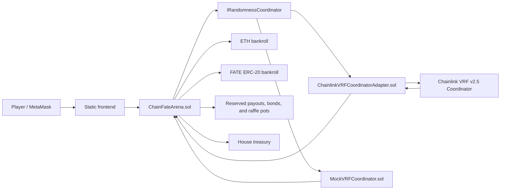
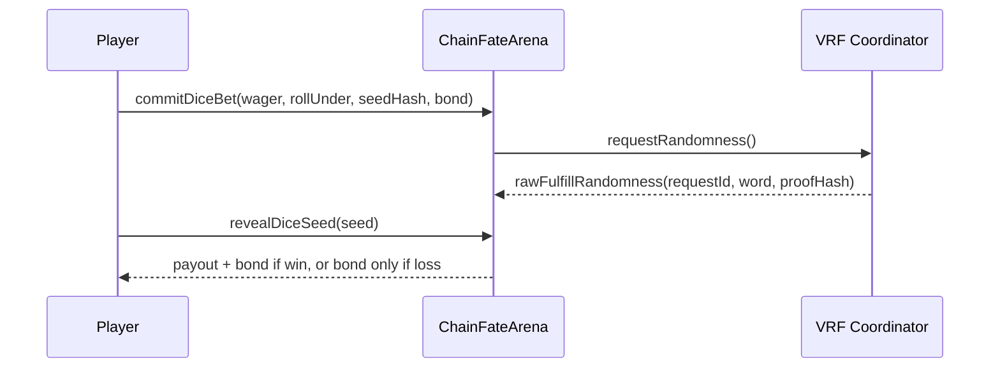
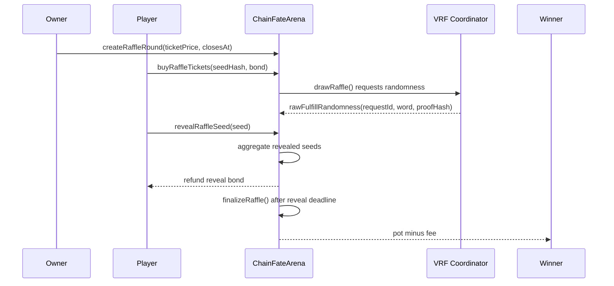

# Architecture

## System Overview

Chain Fate Arena is a single-bankroll gaming platform with two games and a Chainlink-compatible randomness boundary.



## Components

### ChainFateArena

Responsibilities:

- configure accepted tokens and house edge
- hold ETH/ERC-20 bankroll liquidity
- accept dice wagers and raffle ticket purchases
- request randomness through a coordinator interface
- receive callback randomness and proof hashes
- enforce seed commitments and reveal windows
- slash unrevealed bonds
- reserve liabilities so treasury withdrawals cannot drain active games
- pause gameplay during incidents

### ChainlinkVRFCoordinatorAdapter

The production/testnet adapter integrates Chainlink VRF v2.5 while preserving the platform's small randomness interface:

- `ChainFateArena` calls `requestRandomness()`.
- The adapter calls Chainlink `requestRandomWords`.
- Chainlink verifies the VRF proof and calls `rawFulfillRandomWords`.
- The adapter forwards the verified random word to `ChainFateArena.rawFulfillRandomness`.

The adapter uses subscription configuration values: subscription id, VRF coordinator address, key hash, request confirmations, callback gas limit, and native-payment mode.

### MockVRFCoordinator

The mock coordinator models the important integration shape of Chainlink VRF for fast local demos:

- users do not receive randomness synchronously
- the consumer stores a request id
- the coordinator calls back later
- a proof hash is emitted and stored for frontend inspection

For testnet or production, replace this mock with an adapter around Chainlink VRF.

### MockERC20

`FATE` is a local token used to demonstrate ERC-20 betting, approvals, and token-denominated payouts.

## Dice Flow



The final roll is:

```text
roll = keccak256(vrfWord, playerSeed, player, betId) % 100 + 1
```

The seed is committed before the VRF word is known, so the player cannot choose a seed after seeing the oracle result.

## Raffle Flow



The raffle winner is selected from:

```text
keccak256(vrfWord, aggregateRevealedSeeds, roundId, totalTickets)
```

If a player does not reveal, their reveal bond is slashed into the treasury. The VRF word remains sufficient for fairness even if some users withhold seeds.

## Liability Accounting

The contract tracks active obligations separately:

- `reservedDicePayouts`
- `reservedRevealBonds`
- `reservedRafflePots`
- `treasuryBalance`

`availableBankroll(token)` subtracts all active liabilities from the token balance. This prevents the owner from withdrawing funds that are needed for unsettled games.

## Trade-Offs

- The main contract is intentionally compact for a six-week course project.
- Raffle finalization loops over entries, which is acceptable for a demo but not ideal for very large rounds.
- The mock coordinator is not cryptographic VRF. It is an integration-compatible local adapter.
- Ownership is centralized for simplicity. A multisig or timelock should be added before real-money deployment.
